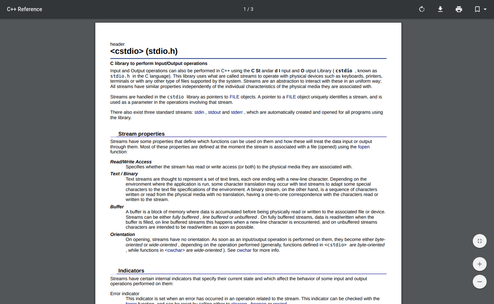

A python script to scrape C++ documentation website and generate printable PDF documents. [More Info](https://animesh-chouhan.github.io/cpp-docs-printer/)

## Setup

### Linux:

Cloning the repository:
```sh
#clone the repo
$git clone https://github.com/animesh-chouhan/cpp-docs-printer.git
$cd cpp-docs-printer
```
Installing the dependencies:

```sh
#install python3-pip
$sudo apt-get install python3-pip

#requests
$sudo pip3 install requests 

#weasy-print
$sudo apt-get install build-essential python3-dev python3-pip python3-setuptools python3-wheel python3-cffi libcairo2 libpango-1.0-0 libpangocairo-1.0-0 libgdk-pixbuf2.0-0 libffi-dev shared-mime-info
$sudo pip3 install WeasyPrint

```
Running the python script:

```sh
$python3 cplusplus.py http://www.cplusplus.com/reference/cstdio/

```

## Usage example

Sample C++ documentation <http://www.cplusplus.com/reference/cstdio/>:

<p align="center">
  
</p>

Sample pdf generated [pdf](https://github.com/animesh-chouhan/cpp-docs-printer/blob/master/pdf/reference-cstdio.pdf):

<p align="center">
  
</p>

The generated .html and .pdf files are located in the html and pdf folders respectively.

_For more examples and usage, please refer to the [Wiki][wiki]._


## Built with

* [requests](https://requests.readthedocs.io/en/master/) - Requests is an elegant and simple HTTP library for Python, built for human beings.
* [beautifulsoup](https://www.crummy.com/software/BeautifulSoup/) - Beautiful Soup is a library that makes it easy to scrape information from web pages.
* [weasyprint](https://weasyprint.org/) - WeasyPrint is a smart solution helping web developers to create PDF documents.


## Contributing

1. Fork the repo (<https://github.com/animesh-chouhan/cpp-docs-printer/>)
2. Create your feature branch (`git checkout -b feature/fooBar`)
3. Commit your changes (`git commit -am 'Add some fooBar'`)
4. Push to the branch (`git push origin feature/fooBar`)
5. Create a new Pull Request

<!-- Markdown link & img dfn's -->
[wiki]: https://github.com/animesh-chouhan/youtube-playman/wiki

## License
MIT License
copyright (c) 2020 [Animesh Singh Chouhan](https://github.com/animesh-chouhan). Please have a look at the [license](LICENSE) for more details.
