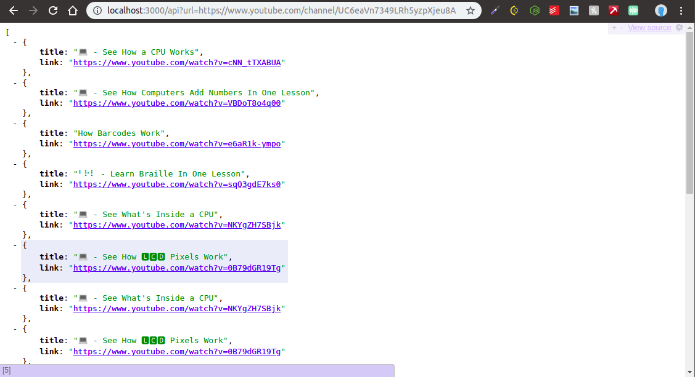

Scrapes all the comments from all videos present in a YouTube channel. Can also be used to get the video list from a given YouTube channel.

## Setup

Linux:

```sh
#clone the repo
git clone https://github.com/animesh-chouhan/yt-comment-scraper.git
cd yt-comment-scraper

#install python3
sudo apt-get install python3

#install node and npm
sudo apt-get install nodejs
sudo apt-get install npm

#install dependencies
npm install express --save
npm install puppeteer --save

#run the api on localhost
node scraper_api.js 

#testing the python scraper
python3 scraper.py ./to_scrape_sample.txt

#create a new text file with links to be scraped separated by newlines
python3 scraper.py ./your_text_file.txt
```


## Usage example

Sample resonse of api hosted on localhost:

<p align="center">
  
</p>

Sample comments scraped:

<p align="center">
  
</p>


_For more examples and usage, please refer to the [Wiki][wiki]._


## Built With

* [Puppeteer](https://developers.google.com/web/tools/puppeteer/) - Headless browser to overcome pagination
* [ytcomments](https://github.com/philbot9/youtube-comment-scraper) - Comment API


## Contributing

1. Fork the repo (<https://github.com/animesh-chouhan/yt-comment-scraper/>)
2. Create your feature branch (`git checkout -b feature/fooBar`)
3. Commit your changes (`git commit -am 'Add some fooBar'`)
4. Push to the branch (`git push origin feature/fooBar`)
5. Create a new Pull Request

<!-- Markdown link & img dfn's -->
[wiki]: https://github.com/animesh-chouhan/yt-comment-scraper//wiki

